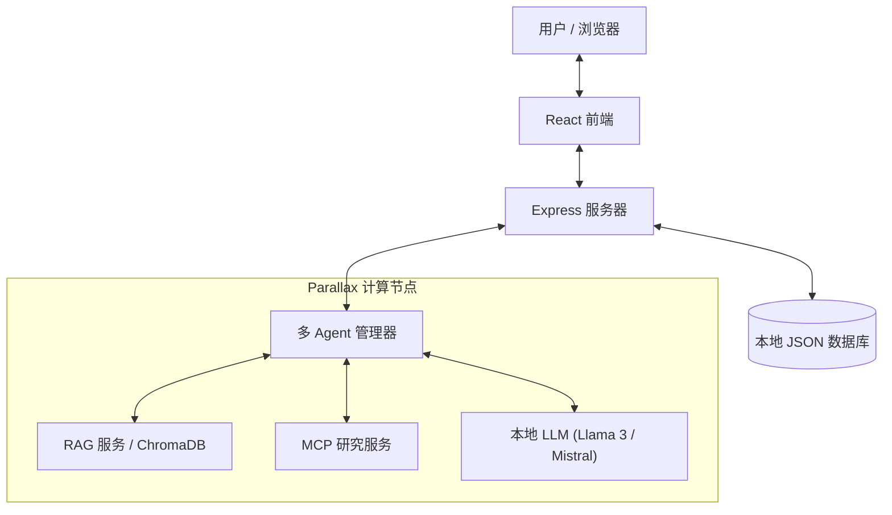

# GradientFlow


> **🏆 打造你的专属 AI 实验室 | Gradient 黑客松参赛作品**
>
> **赛道 2：应用构建 (Building Applications)** | 截止日期：2025年12月7日

[English](./README_HACKATHON_EN.md) | [中文](./README.md)

[](https://github.com/yourusername/gradientflow)
[](https://gradient.network/)
[](./LICENSE)

---

## 🎯 什么是 GradientFlow？

**GradientFlow** 是一个隐私优先、AI 原生的本地 Workspace 平台，旨在为团队和个人提供安全、智能的协作体验。由 **Parallax** 驱动，它利用分布式本地计算来运行强大的 AI Agent，确保数据永远不会离开您的基础设施。

### 💡 我们解决的问题

| 挑战 | 云端 AI 方案 | GradientFlow + Parallax |
|------|-------------|------------------------|
| **数据隐私** | 敏感数据发送至第三方服务器 | 所有数据留在您自己的硬件上 |
| **成本** | 按 Token 计费，费用快速累积 | 部署后零推理成本 |
| **延迟** | 网络往返增加延迟 | 本地推理 = 即时响应 |
| **控制权** | 供应商锁定，模型下线风险 | 您拥有模型和基础设施 |

---

## 🚀 为什么选择 Parallax？

**Parallax** 是 GradientFlow AI 能力的核心支撑。我们如何利用它：

### 分布式本地 AI 基础设施
-   **隐私优先**：所有聊天记录、文档和向量嵌入都存储在您自己的硬件上。绝无敏感数据发送至第三方 API。
-   **成本效益**：利用您现有的 GPU 资源（或通过 Parallax 使用消费级 GPU 集群）运行 LLM，彻底消除 Token 费用。
-   **低延迟**：本地推理确保了实时协作所需的极速响应。
-   **可扩展性**：随着团队增长，可随时向 Parallax 集群添加更多节点。

### 我们如何使用 Parallax
我们将 **Python Agent 服务** 部署在 Parallax 计算节点上，实现：
- 多个专用 Agent（RAG、搜索、摘要生成器）并发运行
- 跨本地 GPU 集群的负载均衡
- 具有自动恢复功能的容错 Agent 执行

---

## ✨ 核心功能

### 🤖 智能本地 Agent
-   **多 Agent 系统**：支持多个 Agent 同时运行（例如 `@Coder`, `@Writer`, `@Researcher`），全部由本地 LLM 驱动。
-   **Agent 选择器**：下拉菜单选择在线 Agent，支持键盘导航。
-   **RAG（检索增强生成）**：上传文档至您的本地知识库。Agent 可以利用 ChromaDB 检索您的私有数据并回答问题。
-   **网络搜索**：集成隐私保护搜索 (DuckDuckGo)，获取实时信息。
-   **MCP 集成**：通过 FastMCP 支持 Model Context Protocol，扩展工具能力。
-   **顺序工具调用**：支持多轮工具的顺序执行。
-   **最大轮次控制**：可配置 Agent 响应的最大轮次。

### 💬 现代聊天体验
-   **智能上下文管理**：精细调优的上下文处理，Agent 能准确理解对话历史、引用关系和 @提及，提供更连贯、更精准的回复。
-   **富文本支持**：完整的 Markdown 支持，代码高亮，以及 LaTeX 数学公式。
-   **交互式体验**：消息表情回应、引用回复以及 @提及功能。
-   **智能摘要**：一键生成长对话的 AI 摘要。
-   **实时同步**：输入状态指示器和实时消息更新。
-   **LLM 设置**：可配置 LLM 端点、模型和 API Key。

### 🛡️ 安全 & 自托管
-   **完全掌控**：您拥有代码、数据和模型的所有权。
-   **身份认证**：安全的 JWT 登录系统。
-   **持久化存储**：所有聊天记录本地存储 (`lowdb`)。

---

## 🛠️ 系统架构

GradientFlow 由三个主要组件构成：

1.  **前端 (Frontend)**: React + Vite (现代 UI/UX)。
2.  **后端 (Backend)**: Express API (管理用户、消息、认证)。
3.  **AI 层 (Parallax)**: Python Agent 服务 + RAG 服务。
    -   *此层设计为部署在 Parallax 计算节点上。*



---

## ⚡ 快速开始

### 前置要求
-   Node.js 18+
-   Python 3.8+
-   运行中的 Parallax 节点（或本地 GPU 环境）

### 安装步骤

1.  **克隆仓库**
    ```bash
    git clone https://github.com/yourusername/parallax-chat.git
    cd parallax-chat
    ```

2.  **启动后端**
    ```bash
    npm install
    npm run server
    ```

3.  **启动 AI 服务 (Parallax 层)**
    ```bash
    cd agents
    pip install -r requirements.txt
    # 连接到您的本地 LLM 后端
    python multi_agent_manager.py
    ```

4.  **启动前端**
    ```bash
    # 新开一个终端窗口
    npm run dev
    ```

5.  **访问应用**
    打开浏览器访问 `http://localhost:5173` 并注册一个新账号。

---

## 📸 截图展示 & 演示

### 聊天界面
*(添加截图：带有 AI Agent 的主聊天界面)*

### Agent 协作
*(添加截图：多个 Agent 在对话中响应)*

### RAG 知识库
*(添加截图：文档上传和知识检索)*

### 视频演示
*(添加视频演示链接)*

---

## 🏆 黑客松提交详情

### 比赛：Build Your Own AI Lab
- **赛道**：赛道 2 - 应用构建
- **截止日期**：2025年12月7日 (美东时间 11:59 PM)
- **奖品**：DGX Spark (第1名), Mac Minis (第2-8名)

### 提交清单

| 要求 | 状态 | 详情 |
|-----|------|------|
| 社交媒体发布 | ✅ | 已在 X 上发布并 @Gradient_HQ |
| GitHub 仓库 | ✅ | 本仓库 |
| 截图 | ✅ | 见上方 |
| 视频演示 | 🔲 | 即将推出 |
| Parallax 集成 | ✅ | 核心架构 |

### GradientFlow 如何展示 Parallax 能力

1. **分布式 AI 推理**：多 Agent 系统在本地 GPU 集群上运行
2. **隐私解决方案**：所有数据处理在本地完成
3. **成本优化**：企业级零 Token 费用
4. **真实用例**：带有 AI 辅助的团队协作

---

## 📢 社交媒体

- **小红书**: [GradientFlow](https://www.xiaohongshu.com/)
- **GitHub**: [给本仓库点星](https://github.com/yourusername/gradientflow)

### 分享我们的项目
```
🚀 看看 GradientFlow - 由 @Gradient_HQ Parallax 驱动的隐私优先、AI 原生 Workspace 平台！

✨ 本地 LLM 推理
🔒 您的数据永远不会离开您的服务器
🤖 多 Agent 协作

#BuildYourOwnAILab #Parallax #LocalAI

GitHub: [your-repo-link]
```

---

## 🆕 最新更新

-   ✅ MCP (Model Context Protocol) 集成，基于 FastMCP
-   ✅ Agent 选择器 UI，支持键盘导航
-   ✅ LLM 配置设置模态框
-   ✅ 顺序工具调用支持
-   ✅ Agent 最大轮次配置
-   ✅ Agent 抽象基类，便于扩展
-   ✅ 隐私保护的 DuckDuckGo 搜索集成
-   ✅ 基于 ChromaDB 的 RAG 知识库

---

## 📄 开源协议

MIT License - 详见 [LICENSE](./LICENSE)

---

*Built with ❤️ for the Gradient Network Community.*

**#BuildYourOwnAILab #Parallax #GradientNetwork**
