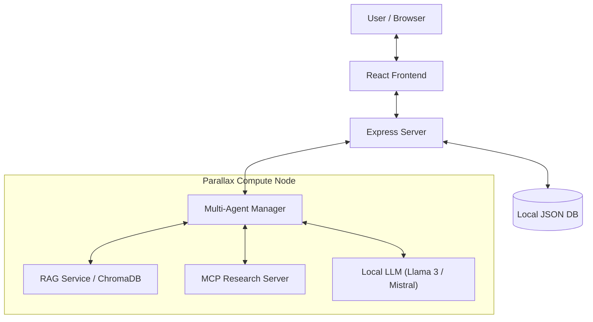

# GradientFlow


> **🏆 Build Your Own AI Lab | Gradient Hackathon Submission**
>
> **Track 2: Building Applications** | Deadline: December 7, 2025

[English](./README_HACKATHON_EN.md) | [中文](./README.md)

[](https://github.com/yourusername/gradientflow)
[](https://gradient.network/)
[](./LICENSE)

---

## 🎯 What is GradientFlow?

**GradientFlow** is a privacy-first, AI-native local Workspace platform designed to empower teams and individuals with secure, intelligent collaboration. Powered by **Parallax**, it leverages distributed local compute to run powerful AI agents without data ever leaving your infrastructure.

### 💡 The Problem We Solve

| Challenge | Cloud AI Solutions | GradientFlow + Parallax |
|-----------|-------------------|------------------------|
| **Data Privacy** | Sensitive data sent to third-party servers | All data stays on YOUR hardware |
| **Cost** | Pay-per-token pricing adds up fast | Zero inference costs after setup |
| **Latency** | Network round-trips add delay | Local inference = instant responses |
| **Control** | Vendor lock-in, model deprecation | You own the models and infrastructure |

---

## 🚀 Why Parallax?

**Parallax** is the backbone of GradientFlow's AI capabilities. Here's how we leverage it:

### Distributed Local AI Infrastructure
-   **Privacy First**: All chat logs, documents, and vector embeddings reside on your own hardware. No sensitive data is sent to third-party APIs.
-   **Cost Efficiency**: Leverage your existing GPU resources (or a cluster of consumer GPUs via Parallax) to run LLMs, eliminating per-token costs.
-   **Low Latency**: Local inference ensures snappy response times for real-time collaboration.
-   **Scalability**: Add more nodes to your Parallax cluster as your team grows.

### How We Use Parallax
We deploy our **Python Agent Service** on Parallax compute nodes, enabling:
- Multiple specialized agents (RAG, Search, Summarizer) running concurrently
- Load balancing across your local GPU cluster
- Fault-tolerant agent execution with automatic recovery

---

## ✨ Key Features

### 🤖 Intelligent Local Agents
-   **Multi-Agent System**: Run multiple agents simultaneously (e.g., `@Coder`, `@Writer`, `@Researcher`) powered by local LLMs.
-   **Agent Selector**: Dropdown menu for selecting online agents with keyboard navigation support.
-   **RAG (Retrieval-Augmented Generation)**: Upload documents to your local Knowledge Base. Agents can retrieve and answer questions based on your private data using ChromaDB.
-   **Web Search**: Integrated privacy-focused search (DuckDuckGo) for real-time information.
-   **MCP Integration**: Model Context Protocol support via FastMCP for extended tool capabilities.
-   **Sequential Tool Calling**: Support for multi-round sequential tool execution.
-   **Max Round Control**: Configurable maximum rounds for agent responses.

### 💬 Modern Chat Experience
-   **Fine-tuned Context Management**: Intelligently processes conversation history, reply threads, and @mentions for more coherent and accurate agent responses.
-   **Rich Text**: Full Markdown support, code highlighting, and LaTeX math.
-   **Interactive**: Message reactions, replies, and @mentions.
-   **Smart Summaries**: One-click AI summary of long conversation threads.
-   **Real-time**: Typing indicators and live updates.
-   **LLM Settings**: Configurable LLM endpoint, model, and API key.

### 🛡️ Secure & Self-Hosted
-   **Full Control**: You own the code, the data, and the model.
-   **Authentication**: Secure JWT-based login system.
-   **Persistent History**: All chats are stored locally (`lowdb`).

---

## 🛠️ Architecture

GradientFlow consists of three main components:

1.  **Frontend**: React + Vite (Modern UI/UX).
2.  **Backend**: Express API (Manages users, messages, auth).
3.  **AI Layer (Parallax)**: Python Agent Service + RAG Service.
    -   *This layer is designed to be deployed on a Parallax compute node.*



---

## ⚡ Quick Start

### Prerequisites
-   Node.js 18+
-   Python 3.8+
-   A running Parallax node (or local GPU environment)

### Installation

1.  **Clone the repository**
    ```bash
    git clone https://github.com/yourusername/parallax-chat.git
    cd parallax-chat
    ```

2.  **Start the Backend**
    ```bash
    npm install
    npm run server
    ```

3.  **Start the AI Services (Parallax Layer)**
    ```bash
    cd agents
    pip install -r requirements.txt
    # Connects to your local LLM backend
    python multi_agent_manager.py
    ```

4.  **Start the Frontend**
    ```bash
    # New terminal
    npm run dev
    ```

5.  **Access the App**
    Open `http://localhost:5173` and register a new account.

---

## 📸 Screenshots & Demo

### Chat Interface
*(Add screenshot: Main chat interface with AI agents)*

### Agent Collaboration
*(Add screenshot: Multiple agents responding in a conversation)*

### RAG Knowledge Base
*(Add screenshot: Document upload and knowledge retrieval)*

### Video Demo
*(Add link to video demonstration)*

---

## 🏆 Hackathon Submission Details

### Competition: Build Your Own AI Lab
- **Track**: Track 2 - Building Applications
- **Deadline**: December 7, 2025 (11:59 PM EST)
- **Prizes**: DGX Spark (1st), Mac Minis (2nd-8th)

### Submission Checklist

| Requirement | Status | Details |
|------------|--------|---------|
| Social Media Post | ✅ | Posted on X with @Gradient_HQ |
| GitHub Repository | ✅ | This repository |
| Screenshots | ✅ | See above |
| Video Demo | 🔲 | Coming soon |
| Parallax Integration | ✅ | Core architecture |

### How GradientFlow Demonstrates Parallax Capabilities

1. **Distributed AI Inference**: Multi-agent system runs on local GPU cluster
2. **Privacy Solution**: All data processing happens locally
3. **Cost Optimization**: Zero per-token costs for enterprises
4. **Real-world Use Case**: Team collaboration with AI assistance

---

## 📢 Social Media

- **ReadNoteBook(小红书)**: [GradientFlow](https://www.xiaohongshu.com/)
- **GitHub**: [Star this repo](https://github.com/yourusername/gradientflow)

### Share Our Project
```
🚀 Check out GradientFlow - A privacy-first, AI-native Workspace powered by @Gradient_HQ Parallax!

✨ Local LLM inference
🔒 Your data never leaves your servers
🤖 Multi-agent collaboration

#BuildYourOwnAILab #Parallax #LocalAI

GitHub: [your-repo-link]
```

---

## 🆕 Recent Updates

-   ✅ MCP (Model Context Protocol) integration via FastMCP
-   ✅ Agent selector UI with keyboard navigation
-   ✅ LLM configuration settings modal
-   ✅ Full Chinese and English localization
-   ✅ Sequential tool calling support
-   ✅ Max rounds configuration for agents
-   ✅ Base agent class for extensibility
-   ✅ Privacy-focused DuckDuckGo search integration
-   ✅ ChromaDB-powered RAG knowledge base

---

## 📄 License

MIT License - See [LICENSE](./LICENSE) for details.

---

*Built with ❤️ for the Gradient Network Community.*

**#BuildYourOwnAILab #Parallax #GradientNetwork**
