# GradientFlow


> **🏆 Build Your Own AI Lab | Gradient Hackathon Submission**
>
> **Track 2: Building Applications**

[English](./README_HACKATHON_EN.md) | [中文](./README.md)

[](https://github.com/yourusername/gradientflow)
[](https://github.com/GradientHQ/parallax)
[](./LICENSE)

---

## 📸 Product Demo


<video src="./assets/GradientFlow_Demo2.mp4" controls width="800"></video>

*If video doesn't play, [click here to download](./assets/GradientFlow_Demo2.mp4)*

**More Screenshots**: [RAG Knowledge Base](#rag-knowledge-base--ai-summary) | [Document Analysis](#intelligent-document-analysis) | [Agent Config](#agent-configuration--mcp-tools)

---

## 🔗 Links

- **Live Demo**: [gradientflow-chat-production.up.railway.app](https://gradientflow-chat-production.up.railway.app/)
- **Xiaohongshu (小红书)**: [GradientFlow](http://xhslink.com/o/1CF3tnSUnuE)
- **Parallax**: [github.com/GradientHQ/parallax](https://github.com/GradientHQ/parallax)

---

## 🎯 What is GradientFlow?

**GradientFlow** is a privacy-first, AI-native local Workspace platform designed to empower teams and individuals with secure, intelligent collaboration. Powered by [**Parallax**](https://github.com/GradientHQ/parallax), it leverages distributed local compute to run powerful AI agents without data ever leaving your infrastructure.

### 💡 The Problem We Solve

| Challenge | Cloud AI Solutions | GradientFlow + Parallax |
|-----------|-------------------|------------------------|
| **Data Privacy** | Sensitive data sent to third-party servers | All data stays on YOUR hardware |
| **Cost** | Pay-per-token pricing adds up fast | Zero inference costs after setup |
| **Latency** | Network round-trips add delay | Local inference = instant responses |
| **Control** | Vendor lock-in, model deprecation | You own the models and infrastructure |
| **Context Understanding** | Each conversation is isolated, lacking coherence | Fine-tuned Context Engineering for conversation history, @mentions, and reply threads |

---

## 🔌 Deep Parallax Integration

[**Parallax**](https://github.com/GradientHQ/parallax) is the AI core engine of GradientFlow. We don't just call APIs — we deeply embed Parallax into our entire architecture.

### How We Integrate

| Component | Parallax Role | Technical Details |
|-----------|--------------|-------------------|
| **Multi-Agent Manager** | Runs multiple agents concurrently on Parallax nodes | Python service deployed on Parallax compute nodes |
| **RAG Knowledge Base** | Local vector retrieval, data never leaves | ChromaDB + Parallax local inference |
| **LLM Inference** | Zero token cost local models | Supports Llama 3 / Mistral / Qwen etc. |
| **Tool Execution** | Web search, MCP protocol toolchain | Distributed task scheduling |

### System Architecture

```mermaid
graph TD
    User["User / Browser"] <--> Frontend["React Frontend"]
    Frontend <--> Backend["Express Server"]
    Backend <--> DB[("Local JSON DB")]

    subgraph "🔌 Parallax Compute Node"
        AgentMgr["Multi-Agent Manager"]
        RAG["RAG Service / ChromaDB"]
        MCP["MCP Tool Service"]
        LLM["Local LLM"]

        AgentMgr <--> LLM
        AgentMgr <--> RAG
        AgentMgr <--> MCP
    end

    Backend <--> AgentMgr
```



### Benefits from Parallax

-   **Privacy First**: All chat logs, documents, and vector embeddings stay on your own hardware
-   **Cost Efficiency**: Use Parallax to orchestrate consumer GPU clusters, eliminating token costs
-   **Low Latency**: Local inference ensures millisecond-level responses
-   **Scalability**: Add more nodes to your Parallax cluster anytime

---

## ✨ Core Features

### 🤖 Intelligent Local Agents `🔌 Parallax Powered`

-   **Multi-Agent System**: Run multiple agents simultaneously (`@Coder`, `@Writer`, `@Researcher`), all powered by Parallax local LLMs
-   **Agent Selector**: Dropdown menu to select online agents with keyboard navigation
-   **RAG Retrieval-Augmented Generation** `🔌`: Upload documents to local knowledge base, agents retrieve private data via ChromaDB
-   **Web Search** `🔌`: Integrated DuckDuckGo privacy search, executed through Parallax nodes
-   **MCP Integration** `🔌`: Model Context Protocol support via FastMCP for extended tool capabilities
-   **Sequential Tool Calling**: Support for multi-round sequential tool execution
-   **Max Round Control**: Configurable maximum rounds for agent responses

### 💬 Modern Chat Experience

-   **Smart Context Management**: Fine-tuned Context Engineering, agents accurately understand conversation history, reply threads, and @mentions
-   **Rich Text Support**: Markdown, code highlighting, LaTeX math formulas
-   **Interactive Experience**: Message reactions, replies, @mentions
-   **Smart Summaries** `🔌`: One-click AI summary of long conversation threads
-   **Real-time Sync**: Typing indicators and live message updates
-   **LLM Settings**: Configurable LLM endpoint, model, and API key

### 🛡️ Secure & Self-Hosted

-   **Full Control**: You own the code, data, and models
-   **Authentication**: Secure JWT-based login system
-   **Persistent Storage**: All chats stored locally (`lowdb`)

---

## ⚡ Quick Start

### Prerequisites
-   Node.js 18+
-   Python 3.8+
-   A running Parallax node (or local GPU environment)

### Installation

1.  **Clone the repository**
    ```bash
    git clone https://github.com/yourusername/parallax-chat.git
    cd parallax-chat
    ```

2.  **Start the Backend**
    ```bash
    npm install
    npm run server
    ```

3.  **Start AI Services (Parallax Layer)**
    ```bash
    cd agents
    pip install -r requirements.txt
    # Connect to your Parallax node
    python multi_agent_manager.py
    ```

4.  **Start the Frontend**
    ```bash
    npm run dev
    ```

5.  **Access the App**
    Open `http://localhost:5173` in your browser

---

## 📷 More Screenshots

### RAG Knowledge Base + AI Summary


### Intelligent Document Analysis


### Agent Configuration + MCP Tools


---

## 📄 License

MIT License - See [LICENSE](./LICENSE) for details.

---

*Built with ❤️ for the Gradient Network Community.*

**#BuildYourOwnAILab #Parallax #GradientNetwork**
